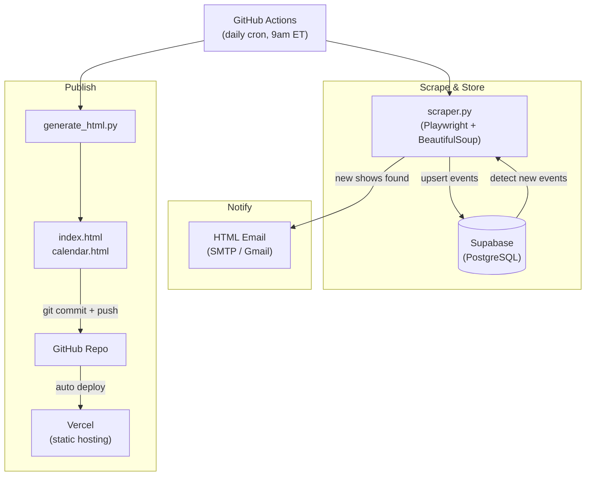

# Atlanta Concert Scraper

Scrapes Atlanta venues for new concert listings and tracks what's been added since your last run. Features intelligent deduplication, clean artist name extraction, and detailed progress output.

## Venues
- **The Eastern** - 30+ events
- **Variety Playhouse** - 40+ events
- **Terminal West** - 50+ events
- **Buckhead Theatre** - 30+ events
- **The Earl** - Variable
- **The Goat Farm** - 120+ events (arts & music)
- **Aisle 5** - 130+ events
- **Fox Theatre**
- **Cobb Energy Centre**
- **The Masquerade** (Heaven, Hell, Purgatory)
- **Center Stage Atlanta** (Center Stage, The Loft, Vinyl)
- **City Winery Atlanta**
- **Helium Comedy Club Atlanta** (Special Events only)

## Features
- ✅ **Smart Deduplication** - Filters out duplicate events using hash-based tracking
- ✅ **Clean Artist Names** - Removes promoter text and navigation elements
- ✅ **Progress Output** - Detailed debug messages showing scraping progress
- ✅ **Change Tracking** - Only reports NEW events since last run
- ✅ **Email Notifications** - Optional HTML email alerts for new shows
- ✅ **Terminal Output** - View results directly in console
- ✅ **Comprehensive Tests** - Full test coverage for all venues

## Setup

### 1. Create Virtual Environment
```bash
python3 -m venv venv
source venv/bin/activate
```

### 2. Install Dependencies
```bash
pip install -r requirements.txt
playwright install chromium
```

### 3. Configure Email (Optional)

Email settings are read from environment variables. Copy the example env file:
```bash
cp .env.example .env
```

Then set values in `.env`:

| Variable | Description | Default |
|---|---|---|
| `EMAIL_ENABLED` | Set to `true` to enable email notifications | `false` |
| `EMAIL_SENDER` | From address | |
| `EMAIL_PASSWORD` | SMTP password / app password | |
| `EMAIL_RECIPIENTS` | Comma-separated list of recipient addresses | |
| `EMAIL_SMTP_SERVER` | SMTP host | `smtp.gmail.com` |
| `EMAIL_SMTP_PORT` | SMTP port | `587` |

**Gmail users:** You'll need an [App Password](https://myaccount.google.com/apppasswords) (not your regular password). Enable 2FA first, then generate an app password.

**Console output only:** Leave `EMAIL_ENABLED` unset or set to `false` to skip email and just use terminal output.

**GitHub Actions / hosted:** Set these same variables as GitHub Actions secrets instead of using a `.env` file (see Scheduling section below).

## Usage

### Run the Scraper
```bash
source venv/bin/activate
python scraper.py
```

**First run** captures all current events as baseline (~600 events).
**Subsequent runs** report only **NEW** additions since last check.

### Example Output
```
============================================================
  Atlanta Concert Scraper — 2026-04-07 14:10
============================================================

Scraping The Eastern...
  → Loading page...
  → Scrolling to load all content...
  → Parsing HTML...
  Found 31 events

[... other venues ...]

============================================================
  RESULTS: 634 total events, 5 NEW
============================================================

🎵 NEW SHOWS:

  📍 The Eastern
     Wed, Apr 8, 2026  Snarky Puppy
     Thu, Apr 16, 2026  Charles Wesley Godwin
     Fri, Apr 17, 2026  Acid Bath
```

### Reset Database
To start fresh and re-baseline:
```bash
rm concerts.db
python scraper.py
```

## Testing

### Quick Integration Test
Test all venues and see sample results:
```bash
source venv/bin/activate
python test_venues.py
```

### Full Unit Test Suite
Run comprehensive pytest tests:
```bash
source venv/bin/activate
pytest test_scraper.py -v
```

**Test Coverage:**
- Event model and hash generation
- Date parsing (multiple formats)
- All venue scrapers
- Deduplication validation
- Artist name extraction
- Invalid entry filtering

See `TESTING_SUMMARY.md` for detailed test results.

## How It Works



## Scheduling (GitHub Actions)

The scraper runs automatically via GitHub Actions on a daily schedule. The workflow:

1. Runs `scraper.py` — scrapes all venues, stores results in Supabase, sends email if new shows are found
2. Runs `generate_html.py` — rebuilds `index.html` and `calendar.html` from the database
3. Commits the updated HTML files and pushes to GitHub
4. Vercel detects the push and deploys the updated static site automatically

To trigger a manual run, go to **Actions → Run Scraper → Run workflow** in the GitHub UI.

### GitHub Actions Secrets

Set these in your repo under **Settings → Secrets and variables → Actions**:

| Secret | Description |
|---|---|
| `SUPABASE_DB_URL` | PostgreSQL connection string |
| `EMAIL_ENABLED` | `true` to enable email notifications |
| `EMAIL_SENDER` | From address |
| `EMAIL_PASSWORD` | SMTP app password |
| `EMAIL_RECIPIENTS` | Comma-separated recipient addresses |
| `EMAIL_SMTP_SERVER` | SMTP host (default: `smtp.gmail.com`) |
| `EMAIL_SMTP_PORT` | SMTP port (default: `587`) |

## Database

Data is stored in `concerts.db` (SQLite) with this structure:

```sql
CREATE TABLE events (
    hash        TEXT PRIMARY KEY,  -- Unique event identifier
    venue       TEXT,
    artist      TEXT,
    date_text   TEXT,
    date_parsed TEXT,              -- ISO format date
    doors       TEXT,
    show_time   TEXT,
    price       TEXT,
    ticket_url  TEXT,
    detail_url  TEXT,
    first_seen  TEXT,              -- When event was first scraped
    last_seen   TEXT               -- When event was last seen
)
```

Query directly for custom reports:
```bash
sqlite3 concerts.db "SELECT venue, artist, date_parsed FROM events WHERE venue = 'The Eastern' ORDER BY date_parsed"
```

## Project Structure

```
concertNotifier/
├── scraper.py              # Main scraper script
├── generate_html.py        # Rebuilds index.html and calendar.html from DB
├── index.html              # Static events listing (served by Vercel)
├── calendar.html           # Static calendar view (served by Vercel)
├── test_scraper.py         # Pytest unit tests
├── test_venues.py          # Integration tests
├── requirements.txt        # Python dependencies
├── .env.example            # Config template
├── .github/
│   └── workflows/
│       └── scraper.yml     # GitHub Actions daily cron workflow
├── README.md               # This file
└── .gitignore
```

## Customization

- **Add a venue**: If it's an AEG site, add a tuple to `VENUES` in `scraper.py`. Otherwise write a custom `scrape_*` function and call it in `run_scraper()`.
- **Notifications**: Modify `send_email()` or hook into the `all_new` return value from `run_scraper()` to send texts, Slack messages, etc.
- **Export**: Query `concerts.db` directly for custom reports and analytics.
- **Filtering**: Adjust venue scraper functions to filter by genre, price, or date range.

## Contributing

Found a bug or want to add a venue? Pull requests welcome! Please include tests for new features.
