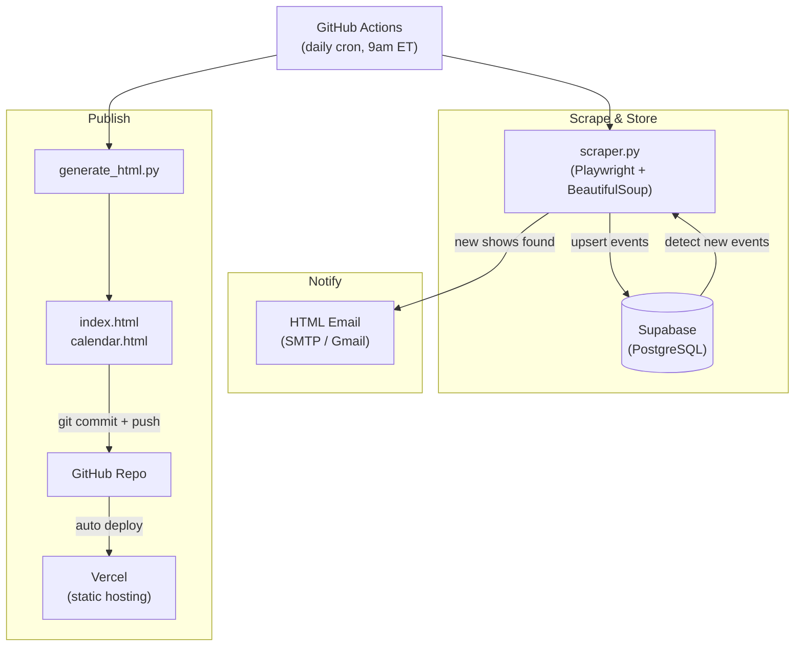

# Atlanta Concert Scraper

Scrapes 13 Atlanta venues daily for new concert listings, stores events in Supabase, sends email notifications for new shows, and publishes a static site via Vercel.

## How It Works



## Venues

- **The Eastern**
- **Variety Playhouse**
- **Terminal West**
- **Buckhead Theatre**
- **The Earl**
- **The Goat Farm**
- **Aisle 5**
- **Fox Theatre**
- **Cobb Energy Centre**
- **The Masquerade** (Heaven, Hell, Purgatory)
- **Center Stage Atlanta** (Center Stage, The Loft, Vinyl)
- **City Winery Atlanta**
- **Helium Comedy Club Atlanta** (Special Events only)

## Features

- Hash-based deduplication — each event is fingerprinted so repeat scrapes never double-count
- New-event detection — only shows added since the last run trigger an email
- Parallel scraping — all venues scraped concurrently via `asyncio.gather`
- HTML email with per-venue grouping
- Static site with venue tabs, calendar view, and artist search

---

## Local Development

### Prerequisites

- Python 3.13+
- A Supabase project with a `SUPABASE_DB_URL` connection string

### 1. Create a virtual environment

```bash
python3 -m venv venv
source venv/bin/activate
```

### 2. Install dependencies

```bash
pip install -r requirements.txt
playwright install chromium
```

### 3. Configure environment

```bash
cp .env.example .env
```

Edit `.env` with your values:

| Variable | Description | Default |
|---|---|---|
| `SUPABASE_DB_URL` | PostgreSQL connection string from Supabase | required |
| `EMAIL_ENABLED` | Set to `true` to enable email notifications | `false` |
| `EMAIL_SENDER` | From address | |
| `EMAIL_PASSWORD` | SMTP app password | |
| `EMAIL_RECIPIENTS` | Comma-separated recipient addresses | |
| `EMAIL_SMTP_SERVER` | SMTP host | `smtp.gmail.com` |
| `EMAIL_SMTP_PORT` | SMTP port | `587` |

**Gmail users:** Use an [App Password](https://myaccount.google.com/apppasswords), not your account password. Requires 2FA to be enabled.

### 4. Run the scraper

```bash
python scraper.py
```

The first run baselines all current events. Subsequent runs report only new additions.

### 5. Generate the static site locally

```bash
python generate_html.py
```

Writes `index.html` and `calendar.html` from the Supabase data.

---

## Production (GitHub Actions + Vercel)

### GitHub Actions

The scraper runs on a daily cron at 9am ET. The workflow:

1. Scrapes all venues and upserts results into Supabase
2. Sends an email if new shows are found
3. Regenerates `index.html` and `calendar.html`
4. Commits and pushes the updated HTML, triggering a Vercel deploy

To trigger a manual run: **Actions → Run Scraper → Run workflow**

### Required Secrets

Set these under **Settings → Secrets and variables → Actions**:

| Secret | Description |
|---|---|
| `SUPABASE_DB_URL` | PostgreSQL connection string |
| `EMAIL_ENABLED` | `true` to enable email |
| `EMAIL_SENDER` | From address |
| `EMAIL_PASSWORD` | SMTP app password |
| `EMAIL_RECIPIENTS` | Comma-separated recipient addresses |
| `EMAIL_SMTP_SERVER` | SMTP host |
| `EMAIL_SMTP_PORT` | SMTP port |

### Vercel Setup

1. Import the GitHub repo in the [Vercel dashboard](https://vercel.com/new)
2. No build command needed — Vercel serves `index.html` as a static site
3. Every push to `main` (including the automated HTML commits) triggers a redeploy

---

## Database

Events are stored in Supabase (PostgreSQL):

```sql
CREATE TABLE public.events (
    hash        TEXT PRIMARY KEY,   -- SHA-256 fingerprint of venue|artist|date|url
    venue       TEXT,
    artist      TEXT,
    date_text   TEXT,               -- Raw date string from the venue site
    date_parsed TEXT,               -- ISO 8601 date (YYYY-MM-DD)
    doors       TEXT,
    show_time   TEXT,
    price       TEXT,
    ticket_url  TEXT,
    detail_url  TEXT,
    first_seen  TIMESTAMPTZ,        -- When the event was first scraped
    last_seen   TIMESTAMPTZ         -- Updated on every subsequent scrape
)
```

Query events directly via the Supabase SQL editor or `psql`:

```sql
SELECT venue, artist, date_parsed
FROM events
WHERE venue = 'The Eastern'
ORDER BY date_parsed;
```

---

## Testing

### Unit tests (no browser or network required)

```bash
pytest test_unit.py -v
```

Covers: event model, hash generation, date parsing, email HTML, and database operations.
Database tests are skipped automatically when `SUPABASE_DB_URL` is not set.

### Venue integration tests (live browser, hits real sites)

```bash
pytest test_scraper.py -v
```

Launches Chromium and scrapes each venue. Slow but confirms end-to-end scraper correctness.

---

## Project Structure

```
concertNotifier/
├── scraper.py              # Main scraper — venues, DB, email
├── generate_html.py        # Builds index.html and calendar.html from Supabase
├── index.html              # Static events listing (served by Vercel)
├── calendar.html           # Static calendar view (served by Vercel)
├── test_unit.py            # Pytest unit tests (no network)
├── test_scraper.py         # Pytest venue integration tests (live browser)
├── test_venues.py          # Manual venue smoke test
├── requirements.txt        # Python dependencies
├── .env.example            # Environment variable template
├── .github/
│   └── workflows/
│       └── scraper.yml     # GitHub Actions daily cron workflow
└── .gitignore
```

---

## Customization

- **Add a venue** — AEG-platform venues: add a tuple to `VENUES` in `scraper.py`. Others: write a `scrape_*` async function and add it to the `asyncio.gather` call in `run_scraper()`.
- **Change the schedule** — edit the `cron` expression in `.github/workflows/scraper.yml`.
- **Add notifications** — hook into the `all_new` list returned by `run_scraper()` to add SMS, Slack, or webhooks alongside email.

## Contributing

Found a bug or want to add a venue? Pull requests welcome — please include tests.
